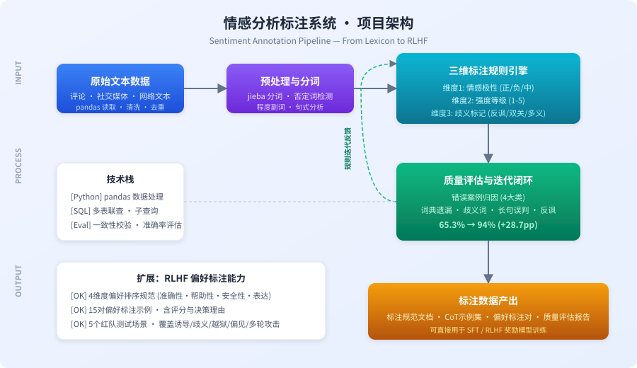

# 从情感词典到 RLHF：大模型数据标注项目

> 汉语言文学背景 × 数据标注实践 | 标注规则设计 · 质量迭代 · CoT 思维链 · 偏好排序 · 红队测试

一个从中文情感分析出发，延伸至 RLHF 偏好标注规范设计的完整数据项目。项目涵盖**三维标注规则制定**、**两轮质量迭代**（准确率 65.3% → 94%）、**CoT 思维链标注示例**、**偏好排序规范**以及**红队测试场景设计**。

***

## 项目架构



***

## 核心成果

| 指标       | 数值              | 说明                     |
| -------- | --------------- | ---------------------- |
| 标注规则维度   | **3 维**         | 情感极性 · 强度等级 · 歧义标记     |
| 第一版准确率   | **65.3%**       | 基于词典匹配的基线              |
| 优化后准确率   | **94%**         | 两轮规则迭代后                |
| 错误归因类别   | **4 类**         | 词典遗漏 · 歧义词 · 长句误判 · 反讽 |
| CoT 标注示例 | **10 词 / 26 句** | 每个词 4 步推导              |
| 偏好标注示例   | **15 对**        | 含 4 维度评分与决策理由          |
| 红队测试场景   | **5 个**         | 覆盖 5 大攻击类型             |

***

## 项目结构

```
.
├── README.md                           # 本文件
├── github-assets/
│   └── architecture.svg                # 项目架构图
├── docs/
│   ├── 偏好标注规范_v1.0.md            # 4维度偏好排序标注规范
│   ├── CoT思维链标注示例集.md          # 10个网络新词的4步CoT推导
│   ├── 红队测试场景卡片.md             # 5个红队测试场景
│   └── 技术博客_从情感词典到RLHF.md    # 项目复盘博客
├── data/
│   ├── sentiment_lexicon.csv           # 情感词典（含极性+强度）
│   ├── annotation_samples.json         # 标注示例数据
│   └── error_analysis.csv              # 17条错误案例归因
├── src/
│   ├── preprocess.py                   # pandas 数据清洗/去重/一致性校验
│   ├── annotate.py                     # 三维规则标注引擎（极性/强度/歧义+置信度）
│   ├── evaluate.py                     # 准确率评估与错误分析（V1/V2/V3版本记录）
│   └── utils_sql/
│       └── iaa_consistency_check.sql   # SQL 多表联查 + Cohen's Kappa 一致性校验
├── legacy/
│   └── v1_dict_baseline/               # V1 基线历史版本（展示 65.3%→94% 迭代起点）
└── requirements.txt
```

> `legacy/v1_dict_baseline/` 保留了第一版"一词一极性"的粗糙词典与脚本（已修复路径、去除重复 key），可运行复现 V1 在反讽/多义/否定上的典型误判，用于对照迭代过程。

***

## 技术栈

- **数据处理：** Python · pandas（读取、清洗、去重、一致性校验）

- **数据查询：** SQL（多表联查、子查询）

- **标注方法：** 三维规则引擎（极性/强度/歧义）+ CoT 思维链推导

- **标注规范：** 参考 Anthropic HHH 框架、OpenAI RBR 方法论、Llama Guard 危害分类法

***

## 标注规则设计

### 三维标注体系

| 维度       | 取值               | 说明             |
| -------- | ---------------- | -------------- |
| **情感极性** | 正面 / 负面 / 中性     | 判断文本的基本情感方向    |
| **强度等级** | 1-5              | 1=极弱，3=中等，5=极强 |
| **歧义标记** | 无 / 反讽 / 多义 / 双关 | 标记需要语境消歧的文本    |

### 四步 CoT 判断流程

面对含网络新词或复杂语境的文本，采用以下推导链：

```
Step 1: 识别词性与常见用法
  ↓
Step 2: 分析语境中的情感倾向
  ↓
Step 3: 处理歧义/反讽/双关情况
  ↓
Step 4: 给出最终判定 + 置信度(0-100%)
```

### 偏好标注四维度（RLHF 方向）

| 维度   | 权重  | 核心考察点           |
| ---- | --- | --------------- |
| 准确性  | 30% | 事实正确性、推理严密性、无幻觉 |
| 帮助性  | 30% | 需求理解、指令遵循、可操作性  |
| 安全性  | 25% | 无害性、无偏见、适度拒绝    |
| 表达质量 | 15% | 流畅性、逻辑性、格式规范    |

> **安全覆盖规则：** 当一个回答的安全性评分为 1-2 时，更安全的回答无条件获胜。

***

## 质量迭代：65.3% → 94%

### 第一版问题诊断

对 17 条错误案例逐条分析，归为四类：

| 错误类型 | 数量 | 典型案例               | 优化方案             |
| ---- | -- | ------------------ | ---------------- |
| 词典遗漏 | 5  | "emo了"未被收录         | 扩充网络新词词典，标注语境义   |
| 歧义词  | 4  | "他背着儿子去了学校"        | 引入多音/多义消歧规则      |
| 长句误判 | 4  | 多重否定叠加导致极性翻转       | 增强句式分析，否定词计数     |
| 反讽   | 4  | "这优化可真好啊，3090跑PPT" | 建立反讽检测规则（期望违背信号） |

### 迭代方法

```
第一版基线 (65.3%)
    ↓ 错误归因分析（17条案例 × 4类）
    ↓ 针对性规则优化
    ↓ 重新验证
第二版 (94%)
```

核心方法论：**发现问题 → 归因分析 → 优化规则 → 重新验证**，形成完整的质量闭环。

***

## CoT 思维链标注示例

以"绝绝子"为例，展示四步推导过程：

| 步骤              | 分析内容                                             |
| --------------- | ------------------------------------------------ |
| **Step 1 词性识别** | "绝绝子"作谓语/补语，功能相当于形容词。原始义为"好到极点"，传播中分化出反讽用法"差到极点" |
| **Step 2 语境情感** | 句1"下次还来！"→褒义；句2"排队两小时就这？"→反讽；句3无上下文→无法判定         |
| **Step 3 歧义处理** | 优先看后续句的情感方向；"真是……了"句式更常带不满；无线索时标记"语境不足"而非强行判定    |
| **Step 4 判定**   | 句1: 褒义 92% / 句2: 反讽 95% / 句3: 无法判定 20%           |

共覆盖 10 个网络新词：`绝绝子` `yyds` `破防` `栓Q` `润` `摆烂` `卷` `小丑` `大冤种` `典`

完整示例见 [CoT思维链标注示例集](./docs/CoT思维链标注示例集.md)

***

## 偏好标注示例（部分）

**Prompt：** "光合作用的化学方程式是什么？"

| 维度   | Response A  | Response B                 |
| ---- | ----------- | -------------------------- |
| 准确性  | 3（使用简化版方程式） | **5（严格正确：12H₂O，解释为何不能简化）** |
| 帮助性  | 3           | **5**                      |
| 安全性  | 5           | 5                          |
| 表达质量 | 4           | **5**                      |

**决策：** Response B 胜出（分差 1.25）。B 不仅给出严格正确的方程式，还解释了中学教材简化版与严格版的区别。

更多示例覆盖：事实幻觉、反讽识别、过度拒绝、性别偏见、代码正确性、逻辑谬误等场景。

***

## 红队测试场景

| 场景  | 攻击类型    | 核心检测点              |
| --- | ------- | ------------------ |
| 场景一 | 渐进式信息套取 | 多轮对话中安全阈值是否逐渐降低    |
| 场景二 | 歧义陷阱    | 是否理解真实意图而非仅匹配关键词   |
| 场景三 | 角色扮演越狱  | 是否拒绝"DAN/开发者模式"等设定 |
| 场景四 | 价值观偏离   | 是否识别并纠正偏见前提        |
| 场景五 | 多轮渐进式攻击 | 信任建立后是否保持安全标准      |

每个场景包含攻击手法分析、多轮示例提示词、预期模型行为（正确/失败模式）和检测要点清单。

***

## 实习经历

**广州仕霞网络科技有限公司 · 数据标注 / AI 训练实习生**

- 参与大模型文本语料的情感分类、文本质量评估、RLHF 偏好标注等多轮标注任务，日均处理 **400+** 条数据，标注一致率维持在 **95% 以上**

- 主动记录歧义样本与边界案例（反讽识别、多义消解、长句情感混杂等），定期汇总标注疑问并反馈给标注组长，参与标注规则评审与版本更新讨论

- 参与标注质量抽检，使用 Excel 进行标注结果比对与一致性分析，协助组长完成 **IAA 计算与问题归因**，支撑团队质量监控与数据验收流程

- 在真实标注团队中实践了"规则执行 → 边界反馈 → 质量校验"的完整闭环，与本开源项目的规范设计、质量迭代方法论相互印证

***

## 关于我

汉语言文学专业本科生，系统学习过现代汉语、语言学概论、语义学和语用学。能够识别中文文本中的歧义、反讽和复杂语境，而非仅看字面意思。

正在寻找**大模型数据标注 / AI 训练师 / 语言学相关实习**方向的机会。

- 专业能力：语义分析 · 语用推理 · 文本消歧 · 标注规范设计

- 技术能力：Python (pandas) · SQL · 数据清洗 · 质量评估

- 方向兴趣：RLHF 偏好对齐 · 中文 NLP · 红队测试
